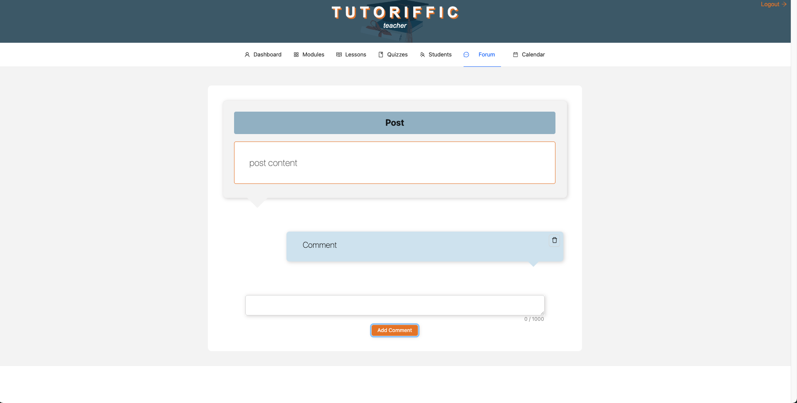
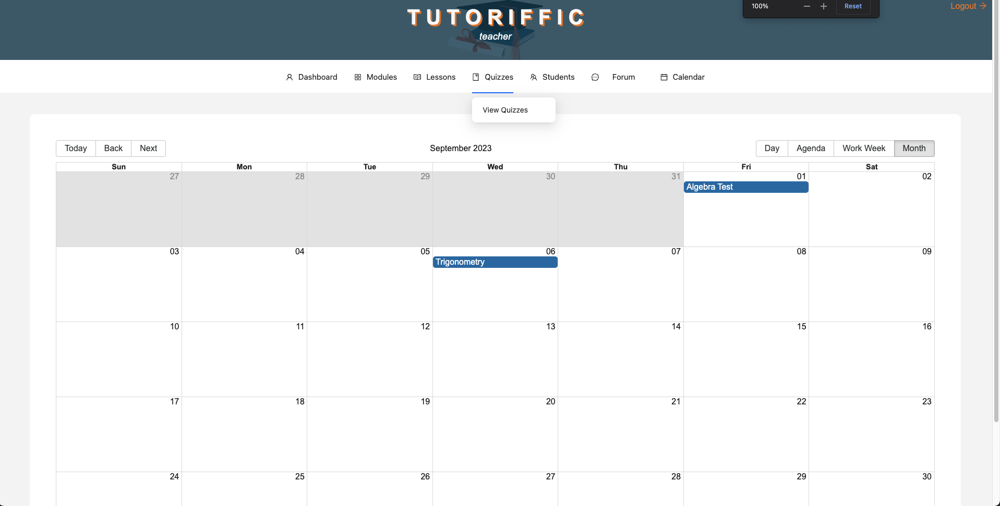

# Tutoriffic-Teacher

PLEASE NOTE: This is a group project completed by myself, Alexander Chrystall, and  Ellis Mcmillan. I have simply cloned the code to my repository so that I am able to deploy it. The original repository where all the commits can be found is https://github.com/emjkenz/Tutoriffic-Teacher.

## Table of Contents
* [Description](#description)
* [Installation](#installation)
* [Screenshots](#screenshots)
* [Usage](#usage)
* [Contribute](#contribute)
* [Contributors](#contributors)
* [Repository](#repository)

## Description

This Repo contains 1/2 of the project for a virtual classroom application. This repo focuses on the Teacher side of the application that shows the teacher their Modules, Assignments, Lesson, and Calendar which will also show the current date and when the Assignments are due and when Lessons will be held. This allows the teacher to keep up with multiple school subjects/modules. There is also a forum that both students and teachers can use to ask/answer questions.

## Screenshots

## Installation

No installation needed. The application can be found at 

## Usage

Upon opening the application the user will have to create an account. They will then be redirected to the dashboard. From there the user can click on 'Modules' in the navbar and create modules. The user can then click on the modules they have created and create a quiz or a lesson. All quizzes and lessons for the module can be found on this page. To view all quizzes or lessons created, irrespective of module, the user can go to the 'Quizzes' or 'Lessons' tab in the navbar. The user can go to the 'Forum' where they will be able to create a forum post as well as view any posts that have been created by all users. To leave a comment on a post, the user can click on a post card, where they will be redirected to the post, where they will see the post information, any comments the post has, and a form to leave a comment. The calendar will show the due dates of all assignments created and the dates that all lessons will be held.

## Contribute

If you would like to contribute to this project in anyway you could try and fix the dashboard for it to be more user friendly.

## Contributors

I would like to acknowledge Alexander Chrystall, Christopher Grace, Ellis Mcmillan, Emily Kennedy, Karra Ormsby and Micheal Hamoud for contribution to this massive project.

## Repository

GitHub: https://github.com/emjkenz/Tutoriffic-Teacher
HTTP: https://github.com/emjkenz/Tutoriffic-Teacher.git
SSH: git@github.com:emjkenz/Tutoriffic-Teacher.git
